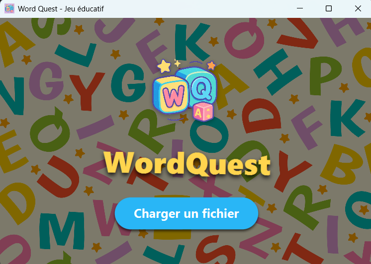
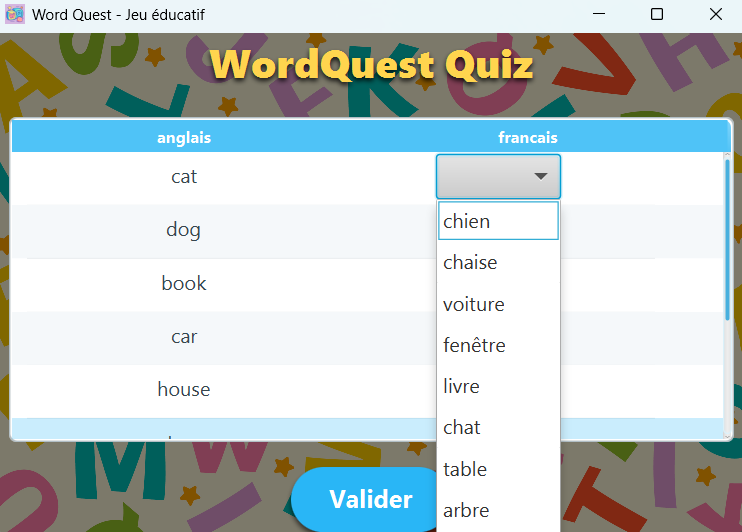
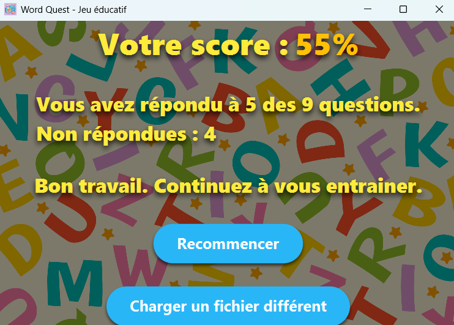

# 🎓 WordQuest

<p align="center">
  
</p>

> **WordQuest** — an open-source educational game for vocabulary learning, built with JavaFX.

---

## 📖 Table of Contents

- [Description](#description)  
- [Features](#features)  
- [Prerequisites](#prerequisites)  
- [Installation](#installation)  
- [Usage](#usage)  
- [CSV Format](#csv-format)  
- [Screenshots](#screenshots)

---

## 📝 Description

WordQuest is a lightweight vocabulary quiz application:

- Load a simple two-column CSV (`word;translation`) → Provide a **ComboBox** in the second column listing **all** translations
- Load a rich multi-column CSV (word;translation;similar;similar;similar;etc.) → provide a ComboBox in the second column listing the correct translation plus all the similar words.
- Display each entry in a JavaFX TableView
- Calculate and show your score as a percentage  

---

## 🚀 Features

- 🔄 Dynamic CSV loading  
- 🗂 Interactive TableView with dropdowns  
- ✔️ Score calculation and display  
- 🔁 Restart quiz or load a new CSV  
- 📦 Ready to import in any JavaFX-capable IDE 

---

## ⚙️ Prerequisites

- Java Development Kit (JDK) 17 or higher  
- An IDE that supports Java and Maven (IntelliJ IDEA, VS Code, etc.)

---

## 🛠️ Installation

Clone and run:

```bash
# 1. Clone repository
git clone https://github.com/yourUsername/wordquest.git
cd wordquest
# 2. Open the project in IntelliJ IDEA
# 3. In the “Project” view, right-click MainApp.java → Run 'MainApp.main()'
```

## 💻 Usage
```bash
# 1. Click “Load CSV” on the start screen.

# 2. Select your CSV file (see CSV Format).

# 3. In the quiz view, choose the correct translation for each word from the dropdown.

# 4. Click “Submit” to see your score and feedback.

# 5. Use “Restart” to clear your answers or “New CSV” to load another file.
```
## 📑 CSV Format

Your file must follow one of these two patterns:
1. Simple two-column
```bash
english;french
cat;chat
dog;chien
book;livre
…etc.

Header row: sourceLang;targetLang

Data rows: word;translation
```

2. Rich multi-column
```bash
english;french;synonym1;synonym2;…
cat;chat;félin;minou;matou
dog;chien;canidé;molosse;cabot
…etc.
```
The ComboBox will include every column after the first.

📸 Screenshots
<div align="center">   &nbsp;&nbsp;  </div>
